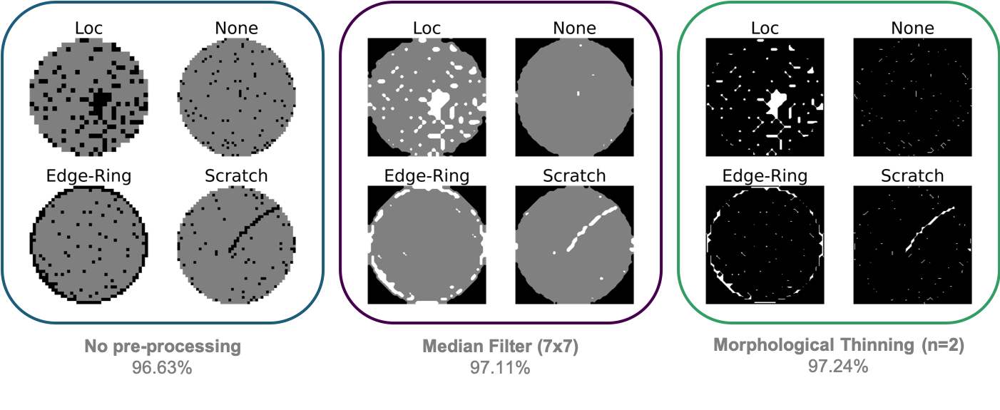
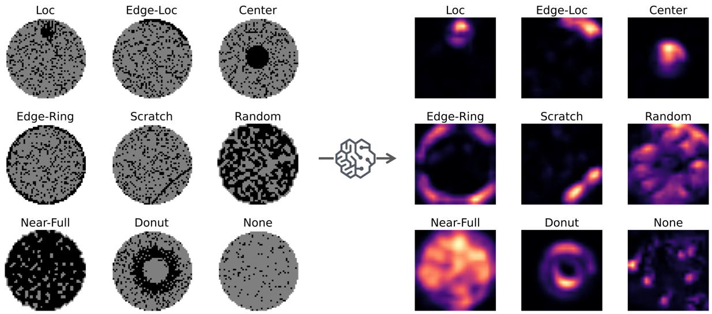
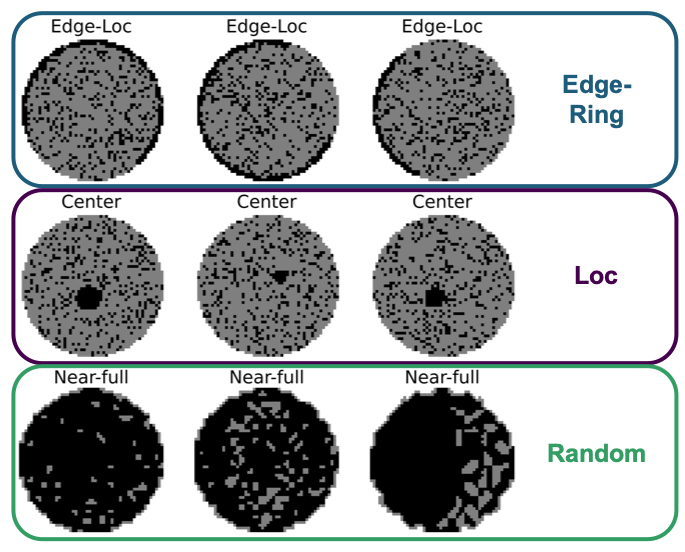

## Automated Wafer Defect Classifier

### MIDS Capstone Project (Spring 2022)

[Final Presentation Slides](https://github.com/LimaEchoAlpha/mids_capstone_wafermap/blob/main/wafermap_final_presentation.pdf)

The aim of the project is to develop a neural network model to identify wafers with single defect patterns and classify them into different defect groups with 90% accuracy.  We used the [WM-811K dataset](https://www.kaggle.com/datasets/qingyi/wm811k-wafer-map), the largest open source dataset from a real-world production process.  This dataset contains pass/fail wafer bin maps from electrical probing after manufacturing, which can be treated as a grayscale image classification problem.

We [explored various model architectures](https://github.com/LimaEchoAlpha/mids_capstone_wafermap/tree/main/modeling) before selecting a final model that improves upon a tandem convolutional neural network published by [Yu, et al.](https://ieeexplore.ieee.org/document/8815875)  We simplified their detection and classification tandem model into a one-step classification model and used a different method for pre-processing to achieve better performance on both our held-out test set (+0.45%) and a previously unseen dataset (+7.09%).

### Data Pre-processing

The paper employs a 7x7 median filter, a method widely used for removing salt and pepper noise while also preserving edges. However, we found that the median filter can wash out slight scratches, affecting the model's performance in classifying scratch defects. We employed two passes of [morphological thinning](https://homepages.inf.ed.ac.uk/rbf/HIPR2/thin.htm) instead, which preserves connected pixels better than median filtering.

|  |
|:--:|
| <b>Comparison of pre-processing performance on Yu paper tandem model</b>|

### Model Architecture

We used the classification model from the Yu, et al paper to classify all 9 defect patterns, including nones.

The model is a 13-layer CNN with three convolutional groups, pooling layers, and three fully connected layers. The convolution kernel size is 3x3 with a stride value of 1 and a Rectified Linear Unit activation. The first two fully connected layers are activated by a Sigmoid function. To avoid overfitting in these two layers, L2 regularization (λ = 0.000001) was added along with Dropout layer (probability = 0.5). Cross entropy is used as the loss function and an Adam algorithm is used for optimization. The batch size was set to 128.

|  |
|:--:|
| <b>Schematic of wafermap classification model architecture</b>|

We [trained the model](https://github.com/LimaEchoAlpha/mids_capstone_wafermap/blob/main/1-final_model_training.ipynb) with the labeled subset of the WM-811K dataset. We used a stratified sampling method to divide the labeled data into train, dev, and test sets to preserve the inherent defect distribution in each set. The model was trained using the train and dev sets for 30 epochs, and results are reported using the held-out test set.

**Our model achieved an overall accuracy of 97.56%**, an improvement of 0.45% over our implementation of the paper tandem model.

### Understanding the model

#### What does the model see?

We visualized our model's last convolutional layer before classification using [Grad-CAM](https://github.com/LimaEchoAlpha/mids_capstone_wafermap/blob/main/3-model_layer_visualization.ipynb) to understand what our model sees. Here we get confirmation that our model is able to identify the defect patterns clearly.

|  |
|:--:|

#### How well does the model generalize?

To see how well our model would generalize, we [tested it on a secondary dataset](https://github.com/LimaEchoAlpha/mids_capstone_wafermap/blob/main/2-final_model_inference.ipynb). We did not use this dataset in training because it is mostly synthetic data generated from a GAN. It has an unrealistically balanced distribution between all defect classes and is much more homogenous within each class than the WM-811K dataset we used for training.

Testing with the second dataset, our model achieved a **marked improvement of 7.09% over the paper tandem model**. However, the overall accuracy was low at 76.02%.

Error analysis showed that our model is misclassifying three main classes. When we visualize examples of these mislabeled wafers, we can see how the model would make these errors. Our model seems to be stumbling over a systematic labeling issue.

|  |
|:--:|

Since these mislabeled classes have similar defect mechanisms, we recalculated our results to see how our model would have performed if these classes were combined. **Our recalculated accuracy comes out to 90.62%**. This gives us confidence in how well our model can generalize.
