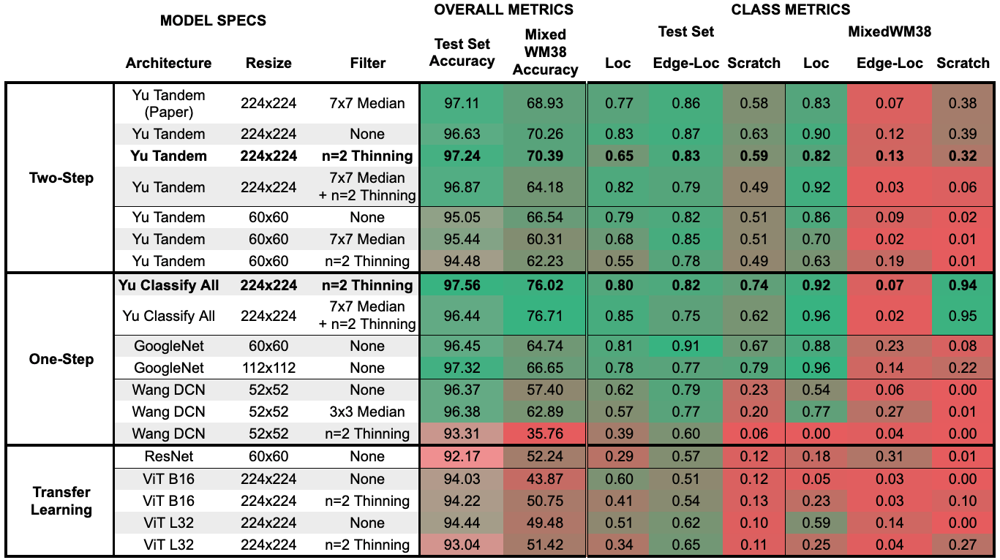

### Model Exploration

Various combinations of model architecture and data pre-processing were explored.  Overall accuracy of the models were compared along with recall for the most mis-classified labels (Loc, Edge-Loc, and Scratch).

Performance of all the architectures tried exceeded the initial goal of 90% accuracy on the held-out test set from the WM-811K dataset.  To see how well the models would generalize, they were tested on a second dataset (MixedWM38).  This dataset contains mostly synthetic data generated from a GAN.  It has an unrealistically balanced distribution between all the defect classes and is much more homogeneous within each class than WM-811K.

